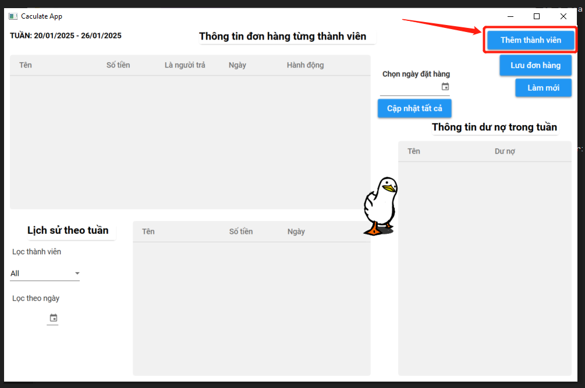
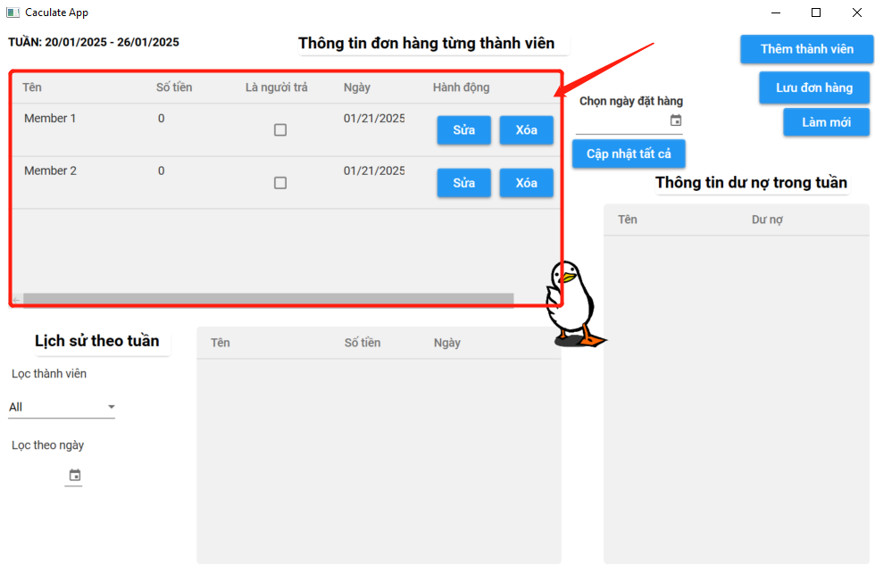
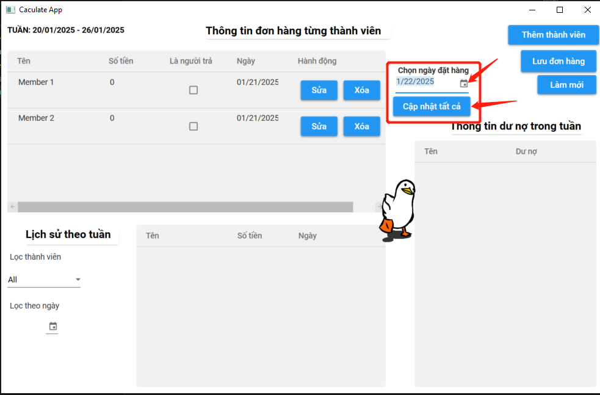
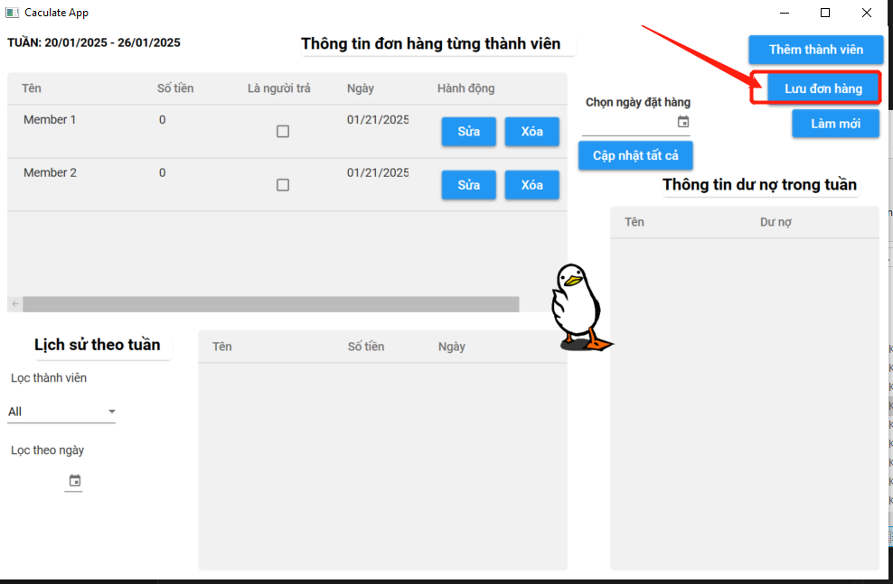
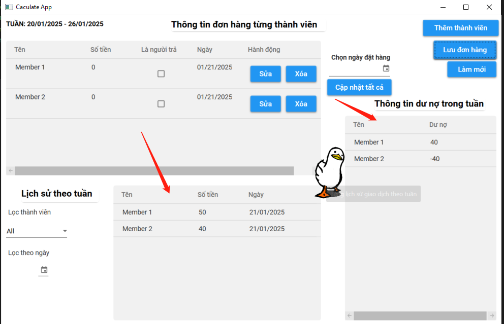

# **Caculate App**

1. Introduction

Caculate App is written by C# with WPF App template. It is used to store the orders every week of a team, then can use to caculate outstanding of each member at the last day of week. A simple wpf application for learning.

2. Tech used

- WPF App C#
- SQLite
- MaterialDesign for UI
- .NET 8

3. Documentation for using

- Create member: the first step you need to do is create all the members will join the team for ordering

- Fill order detail data in the first data grid view: After having members, you can fill order detail with money and date for each member

- Note: if you want to update date field for all members, can select custom date and click update all

- **IMPORTANT NOTE:** please choose **only one** payer by check the checkbox in column IsPayer

- Save order: after finishing to fill data grid, can click save order to save to database

- Report and Outstanding: after saving the order, can see the report below the first data grid view

- Filter report: you also can filter by member name and created date

